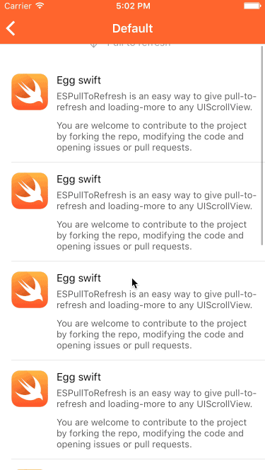
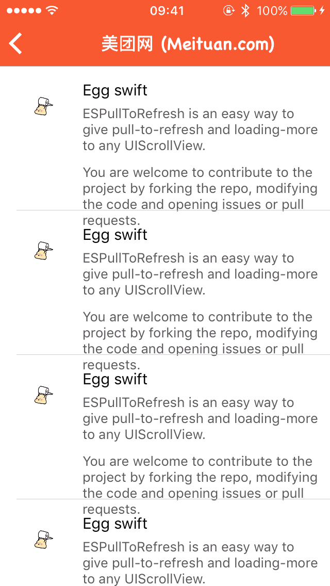
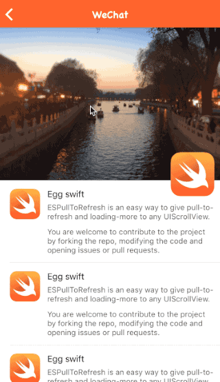

<!--  -->

[](https://travis-ci.org/eggswift/pull-to-refresh)
[](http://cocoapods.org/pods/pull-to-refresh)
[](https://github.com/Carthage/Carthage)
[](https://developer.apple.com/swift/)
[](https://twitter.com/lihao_iOS)
[](http://weibo.com/5120522686/profile?rightmod=1&wvr=6&mod=personinfo&is_all=1)

### [For English](README.md)

**ESPullToRefresh**是一个非常易于开发者使用的下拉刷新和加载更多组件。通过一个UIScrollView的扩展，可以轻松为UIScrollView的所有子类添加下拉刷新功能。 如果你想定制组件的UI样式，只要实现指定的协议方法即可。


## 支持环境

* Xcode 8 or later
* iOS 8.0 or later
* ARC
* Swift 5.0 or later

## 特性

* 支持UIScrollView及其子类UICollectionView、UITableView、UIWebView等；
* 支持下拉刷新和上拉加载更多；
* 支持定制自己所需的样式；
* 支持刷新时间缓存，设置过期时间并策略刷新。

## Demo

下载后运行ESPullToRefreshExample工程，你可以看到一些使用ESPullToRefresh实现的自定义下拉刷新和加载更多例子。


## 如何安装

### CocoaPods

``` ruby
pod "ESPullToRefresh"
```

### Carthage

```ruby
github "eggswift/pull-to-refresh"
```

### 手动安装

``` ruby
git clone https://github.com/eggswift/pull-to-refresh.git
open ESPullToRefresh
```

## 开始使用

### 使用默认样式:

#### 效果如下:




将ESPullToRefresh导入至你的工程

```swift
import ESPullToRefresh
```

设置默认下拉刷新组件

```swift
self.tableView.es.addPullToRefresh {
    [unowned self] in
    /// 在这里做刷新相关事件
    /// ...
    /// 如果你的刷新事件成功，设置completion自动重置footer的状态
    self.tableView.es.stopPullToRefresh(completion: true)
    /// 设置ignoreFooter来处理不需要显示footer的情况
    self.tableView.es.stopPullToRefresh(completion: true, ignoreFooter: false)
}
```

设置默认加载更多组件
``` swift
self.tableView.es.addInfiniteScrolling {
    [unowned self] in
    /// 在这里做加载更多相关事件
    /// ...
    /// 如果你的加载更多事件成功，调用es_stopLoadingMore()重置footer状态
    self.tableView.es.stopLoadingMore()
    /// 通过es_noticeNoMoreData()设置footer暂无数据状态
    self.tableView.es.noticeNoMoreData()
}
```


### 使用自定义样式

#### 效果如下:



注: 加载动画资源来自美团 iOS app。




**ESPullToRefresh**通过**ESRefreshProtocol**和**ESRefreshAnimatorProtocol**来约束刷新组件的使用，自定义的组件必须遵守这两个协议，并实现协议中的方法。

设置自定义下拉刷新组件
``` swift
func es.addPullToRefresh(animator animator: protocol<ESRefreshProtocol, ESRefreshAnimatorProtocol>, handler: ESRefreshHandler)
```

设置自定义加载更多组件
``` swift
func es.addInfiniteScrolling(animator animator: protocol<ESRefreshProtocol, ESRefreshAnimatorProtocol>, handler: ESRefreshHandler)
```

### 设置过期时间和自动刷新

ESPullToRefresh支持最近刷新时间和过期时间缓存，您需要为UIScrollView子类设置`refreshIdentifier`标示。
``` swift
scrollView.refreshIdentifier = "Your Identifier" // 设置当前ScrollView的标识
scrollView.expriedTimeInterval = 20.0 // 设置过期时间间隔
```
你可以通过`es.autoPullToRefresh()` 方法，当上次刷新时间超过过期时间间隔时自动刷新。
``` swift
scrollView.es.autoPullToRefresh()

let expried = scrollView.espried // 获取是否过期
```


### 移除方法

``` swift
func es.removeRefreshHeader()
func es.removeRefreshFooter()
```


## 赞助

您可以通过查看我们的赞助商页面来支持该项目。 只需单击一下即可：

<a href='https://tracking.gitads.io/?repo=pull-to-refresh'></a>
<br><i>这则广告来自 <a href="https://tracking.gitads.io/?campaign=gitads&repo=pull-to-refresh&redirect=gitads.io">GitAds</a> </i>


## 关于

ESPullToRefresh[lihao](mailto:lihao_iOS@hotmail.com)开发和维护。如果你在使用过程中遇到什么疑问或任何问题，欢迎提交 [issue](https://github.com/eggswift/pull-to-refresh/issues) 随时交流。</br>
如果你想为ESPullToRefresh输出代码，请提交 [Pull Request](https://github.com/eggswift/pull-to-refresh/pulls)，我会尽可能快的去处理。</br>

[](https://twitter.com/intent/tweet?text=https://github.com/eggswift/pull-to-refresh)
[](https://twitter.com/lihao_iOS)


## 使用许可

The MIT License (MIT)

Copyright (c) 2013-2020 eggswift (https://github.com/eggswift/pull-to-refresh)

Permission is hereby granted, free of charge, to any person obtaining a copy
of this software and associated documentation files (the "Software"), to deal
in the Software without restriction, including without limitation the rights
to use, copy, modify, merge, publish, distribute, sublicense, and/or sell
copies of the Software, and to permit persons to whom the Software is
furnished to do so, subject to the following conditions:

The above copyright notice and this permission notice shall be included in all
copies or substantial portions of the Software.

THE SOFTWARE IS PROVIDED "AS IS", WITHOUT WARRANTY OF ANY KIND, EXPRESS OR
IMPLIED, INCLUDING BUT NOT LIMITED TO THE WARRANTIES OF MERCHANTABILITY,
FITNESS FOR A PARTICULAR PURPOSE AND NONINFRINGEMENT. IN NO EVENT SHALL THE
AUTHORS OR COPYRIGHT HOLDERS BE LIABLE FOR ANY CLAIM, DAMAGES OR OTHER
LIABILITY, WHETHER IN AN ACTION OF CONTRACT, TORT OR OTHERWISE, ARISING FROM,
OUT OF OR IN CONNECTION WITH THE SOFTWARE OR THE USE OR OTHER DEALINGS IN THE
SOFTWARE.

